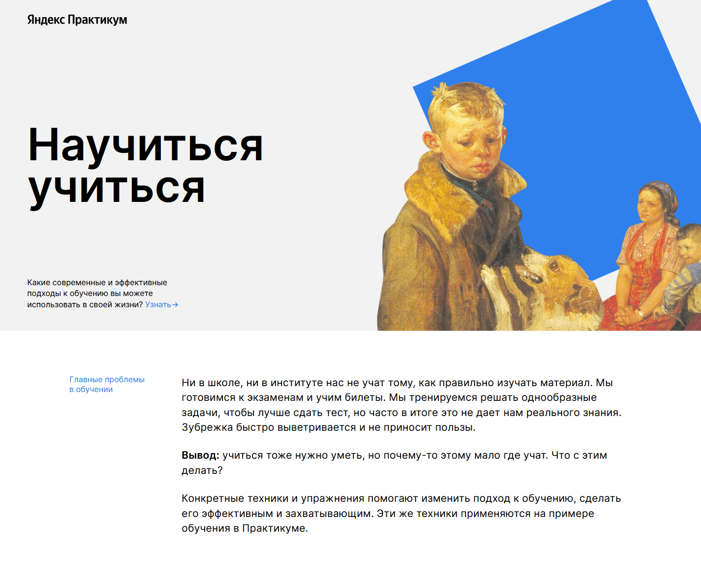

#Проектная работа "Как учиться" Яндекс практикум плюс

****

Одностраничный сайт с использованием:

методологии BEM

 iframe

##Запуск проекта

Клонируйте репозиторий git clone https://github.com/M0riaz/how-to-learn-plus.git

Откройте проект в редакторе кода, например, Web storm.

В правом верхнем углу запустите в одном из предложенных браузеров.

